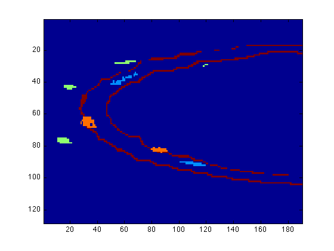
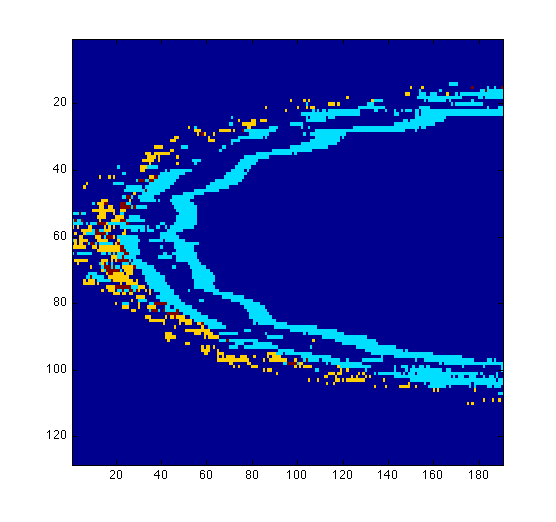
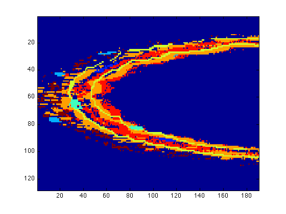
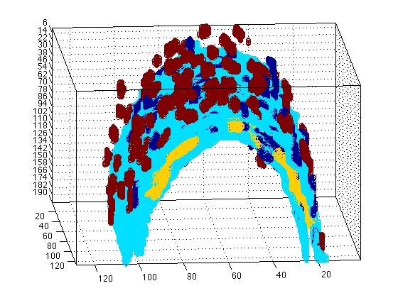
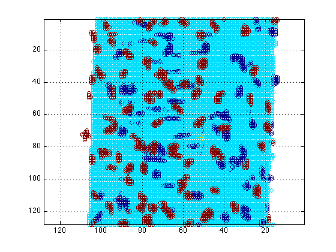

# Quantify-Protein-Expression
Quantification of Protein Expression and Nuclei counting from 4-channel fluorescent arteries

<h1>Manual to use the quantification of expressions and nuclei</h1><!--introduction-->

This software was used for the following publication: 

Kathleen A Pennington, Francisco I Ramirez-Perez, Kelly E Pollock, Omonseigho O Talton, Christopher A Foote, Constantino C Reyes-Aldasoro, Ho-Hsiang Wu, Tieming Ji, Luis A Martinez-Lemus, Laura C Schulz,
Maternal hyperleptinemia is associated with male offspring’s altered vascular function and structure in mice,
<a href="http://journals.plos.org/plosone/article?id=10.1371/journal.pone.0155377">PloS one</a>, Vol. 11 Is. 5, pp. e0155377

To use the matlab functions, the first requirement is that the ALL the images are saved in one folder (say images) and then a subfolder  for each channel of the data with the following order:

<pre>   channel0 - YELLOW = Phalloidin staining of ACTIN fibers')
   channel1 - RED    = Alexa staining of ELASTIN')
   channel2 - BLUE   = DAPI nuclei')
   channel3 - GREEN  = Second harmonic imaging of COLLAGEN')</pre><!--/introduction-->

When you have several experiments, you can save each experiment in a folder, that is all the folders of the channels per separate folders, e.g. images/channel0, images/channel1, images/channel2, ... images2/channel0, images2/channel1, etc.

Then, you need to save the matlab functions in any working folder, for instance, the same folder where you will have the folders for the data.

<h2>Quantification of the expression</h2>

To quantify the expression of all channels, the nuclei, etc., you will use the function "QuantifyRelativeExpression", to do this, open matlab, change to the working folder and then call the function in the following way:

<pre class="codeinput">[totExpression,locExpression,numFinalNuclei,finalData,ElastinVsCollagen,NucleiVsElastinBoundary] = QuantifyRelativeExpression('images');
</pre>

<pre class="codeoutput">190 images in folder, with dimensions:1024 x1024 x1</pre>

 This function, opens all the images in the folders and through several steps will detect
 the boundaries of the Elastin, the expression of each channel by detecting the pixels
 (voxels actually since the data is 3D) above thresholds, and quantify the number of
 elements in each of the channels. These results will be stored in the variable
 "totExpression". Then, the boundaries of the elastin will be used to distinguish the
 expression inside them and the results will be stored inside the variable
 "locExpression". The nuclei will also be counted and the number will be split into those
 nuclei that are (a) inside the elastin boundaries, (b) outside the boundaries and (c) those that are touching the
 boundaries.

 You can always call the function without parameters like this

[totExpression,locExpression,numFinalNuclei,finalData,ElastinVsCollagen,NucleiVsElastinBoundary] = QuantifyRelativeExpression();
</pre>

</pre>
and then a window will open and you can select the folder with the data manually. To visualise the results you can just type on the command prompt the name of the variable:

 <pre class="codeinput">totExpression
</pre>

<pre class="codeoutput">
totExpression =

    20680441    18914975     1363137     4932066

</pre><h2>Displaying the data

</h2>
To display the data you have processed, you can use the function surfdat in the following way:

<pre class="codeinput">figure(1)
surfdat(NucleiVsElastinBoundary(51,:,:))

figure(2)
surfdat(ElastinVsCollagen(51,:,:))

figure(3)
surfdat(finalData(51,:,:))
</pre>

Or try the three-dimensional view:
<pre class="codeinput">surfdat(NucleiVsElastinBoundary,'all')
</pre>

The previous plot is Three-dimensional, so you can rotate it to have a better view, or you can type to change the view:

<pre class="codeinput">view(90,90)
</pre>

 
